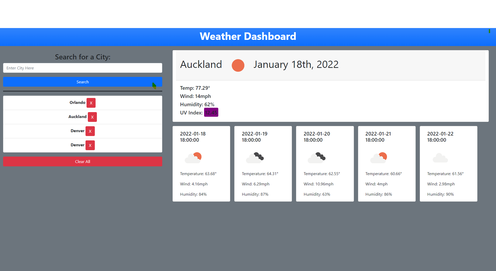

# Weather Dashboard

## Description

A simple web application to get a cities weather. It is using a third party API "Open Weather".

## Table of Contents

- [Installation](#installation)
- [Usage](#usage)
- [License](#license)
- [Contributing](#contributing)
- [Testing](#testing)
- [Questions](#questions)

## Installation

For installation you just need to run the website. If you are going to copy the code please use your own API Key.

## Usage

To access the application you can go to: https://thomashighum.github.io/WeatherApp/

## License

This application is covered under the MIT license.

## Contributing

Not needed

## Testing

No testing set up at this time.

## Questions

If you have any questions, please feel free to contact me via:

- Github: [thomashighum](https://github.com/thomashighum)
- Email: [tommyhighum@gmail.com](mailto:tommyhighum@gmail.com)
